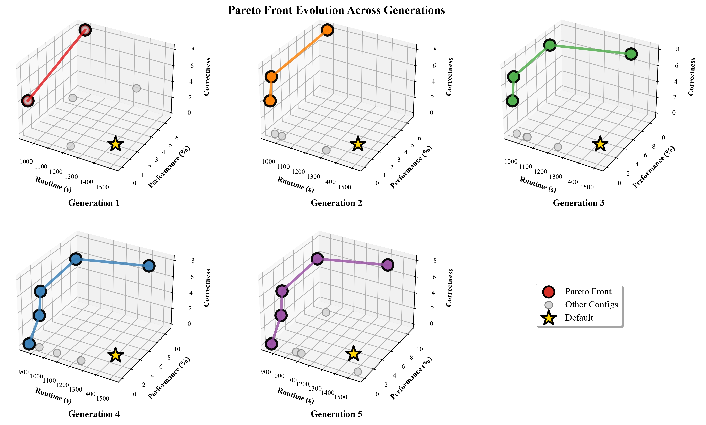

# GA4GC: Greener Agent for Greener Code via Multi-Objective Configuration Optimization

## Overview

GA4GC (Greener Agent for Greener Code) addresses the critical challenge of sustainable coding agent deployment by optimizing the dual trade-off between agent runtime (greener agent) and code performance gain (greener code). While coding agents can successfully solve complex real-world tasks, they consume significant computational resources—a single agent run can consume over 100,000 tokens, translating to hundreds of dollars per optimization task and substantial environmental impact.

**The Problem**: Without careful tuning, coding agents can consume over 100,000 tokens per task, creating prohibitive operational costs and substantial environmental impact. The energy consumed by an optimization agent can be so substantial that the resulting code may need to be executed hundreds of thousands of times to reach an energetic "break-even point," making the optimization a net energy loss.

**Our Solution**: GA4GC employs NSGA-II multi-objective optimization to automatically discover Pareto-optimal agent configurations across the vast hyperparameter space, enabling up to **37.7% agent runtime reduction** while improving code performance and correctness.


## Research Contributions

This framework demonstrates three key contributions:

1. **Multi-Objective Optimization Framework**: Discovers Pareto-optimal coding agent configurations achieving up to 37.7% agent runtime reduction (943.1s vs 1513.3s) while improving code performance and correctness, and up to 135× hypervolume improvement over default configurations.

2. **Comprehensive Hyperparameter Analysis**: Reveals that temperature is the most critical factor (0.392 code performance influence), while timeout constraints improve agent efficiency and top_p/cost_limit create agent-code performance trade-offs.

3. **Actionable Green SBSE Strategies**: Provides three deployment strategies: agent runtime-focused (Config#4), code performance-focused (Config#15), and balanced (Config#5), enabling context-specific optimization for sustainable coding agent deployment.

## Repository Structure

```
GA4GC/
├── mini-swe-agent/              # Base coding agent framework
├── ga/                          # Genetic algorithm optimization
│   ├── ga.py                   # Main optimization script (NSGA-II)
│   ├── agentsRunner.py         # Agent evaluation runner
│   ├── problem.py              # Multi-objective problem definition
│   ├── run_single_config.py    # Single configuration evaluator
│   ├── template.yaml           # Configuration template
│   ├── evaluation/             # Evaluation infrastructure
│   ├── figures/                # Visualization results
│   └── results/                # Optimization and analysis results
├── configurations/             # Agent configuration files
│   ├── default.yaml            # Baseline configuration (1513.3s runtime)
│   ├── baseline1.yaml          # Speed-focused template (5 steps)
│   ├── baseline2.yaml          # Balanced template (10 steps)  
│   ├── baseline3.yaml          # Quality-focused template (20 steps)
│   ├── pareto_eval4_config.yaml # Agent runtime-focused (37.7% faster)
│   ├── pareto_eval5_config.yaml # Balanced optimization (4× correctness)
│   ├── pareto_eval9_config.yaml # Correctness-focused (3.5× improvement)
│   ├── pareto_eval15_config.yaml # Code performance-focused (10.67% gain)
│   └── pareto_eval16_config.yaml # Maximum agent speed (43.6% reduction)
└── requirements.txt           # Python dependencies
```

## Prompt Templates

GA4GC explores three distinct prompt template strategies, each optimized for different agent-code performance trade-offs:

### **Template 1: Speed-Focused** (`baseline1.yaml`)
- **Steps**: 5 steps maximum
- **Philosophy**: Quick, high-impact optimizations with minimal agent runtime
- **Strategy**: Target only the most obvious performance improvements
- **Use Case**: Resource-constrained environments prioritizing agent efficiency
- **Characteristics**: Brief analysis, immediate wins, minimal exploration

### **Template 2: Balanced** (`baseline2.yaml`)  
- **Steps**: 10 steps maximum
- **Philosophy**: Strategic optimization balancing quality and efficiency
- **Strategy**: Thoughtful optimizations with sustainable improvements
- **Use Case**: General-purpose deployment requiring both agent and code performance
- **Characteristics**: Strategic planning, impact analysis, balanced approach

### **Template 3: Quality-Focused** (`baseline3.yaml`)
- **Steps**: 20 steps maximum
- **Philosophy**: Comprehensive optimization for maximum code performance gains
- **Strategy**: Systematic, thorough optimization with extensive verification
- **Use Case**: Performance-critical scenarios where code optimization is paramount
- **Characteristics**: Detailed analysis, multiple optimization passes, extensive verification

## Optimization Visualizations

### NSGA-II Performance

#### Pareto Front Evolution (`pareto_front_evolution.jpg`)



- 5 generations of Pareto front evolution in 3D space
- Gray points: All evaluated configurations
- Colored points (Red→Purple): Pareto-optimal solutions per generation
- Gold star: Default configuration baseline
- Shows systematic growth from 2→5 solutions with evolutionary memory

#### Convergence Metrics (`convergence_metrics.jpg`)


- Hypervolume: 70.6%→83.0% (+17.5%)
- Pareto solutions: 2→5 (+150%)
- 80% of configurations dominated by final front
- Demonstrates directed search with clear upward trends

### Baseline Comparison: NSGA-II vs Random Search

To validate that NSGA-II performs directed search rather than random behavior, we ran a baseline comparison with random search using identical evaluation budget and search space.

**Random Search Configuration**:
- **Evaluation Budget**: 25 configurations (same as NSGA-II: 5 generations × 5 population)
- **Search Space**: Identical to NSGA-II (8 hyperparameters with same ranges)
- **Sampling**: Uniform random sampling from continuous/integer ranges, random selection for categorical
- **Seed**: 1 (for reproducibility)
- **Results**: `ga/results/random_search_results_20251003_215728.csv`

#### Evolution Comparison (`comparison_pareto_fronts.jpg`)


- **NSGA-II (top)**: Systematic growth 2→3→4→5→5 solutions
- **Random Search (bottom)**: Stagnation 2→2→2→3→3 solutions
- NSGA-II discovers 2 more Pareto solutions (+67%)

#### Convergence Comparison (`comparison_convergence.jpg`)


- **Hypervolume**: NSGA-II 83.0% vs Random 53.1% (+29.9% advantage)
- **Pareto Size**: NSGA-II 5 vs Random 3 (+67% more solutions)
- **Solution Quality**: NSGA-II achieves 8 correctness (vs 6) and 10.67% performance (vs 7.05%)

**Conclusion**: NSGA-II significantly outperforms random search, demonstrating directed multi-objective optimization with systematic convergence and superior solution quality.

## Installation

### 1. Environment Setup
```bash
# Create conda environment
conda env create -f environment.yml
conda activate sweperf

# Or install with pip
pip install -r requirements.txt
```

### 2. API Configuration
Set up your Gemini API key:
```bash
export GEMINI_API_KEY="your_api_key_here"
```

### 3. Base LLM Configuration
To change the base LLM, modify the model configuration in yaml files:
```yaml
model:
  model_name: "gemini-v25-pro"  # Change to desired model
```


## Methodology

### Multi-Objective Optimization Framework

**Optimization Algorithm**: NSGA-II (Non-dominated Sorting Genetic Algorithm II)
- **Population Size**: 5 configurations per generation
- **Generations**: 5 (25 total evaluations)
- **Selection**: Binary tournament selection
- **Crossover**: Simulated binary crossover (probability = 0.9)
- **Mutation**: Polynomial mutation (probability = 1/n_vars, where n_vars = 8)
- **Seed**: 1 (for reproducibility)
- **Runtime**: 25-35 hours per run
- **Cost**: $50-100 LLM API costs per run

**Optimization Process**:
1. **Training Phase** (9 instances):
   - Each of the 25 configurations is evaluated on 9 training instances
   - Agent generates optimization patches through iterative reasoning
   - Measure three objectives for each configuration:
     - f₁ = Correctness (instances passing all tests, max = 9)
     - f₂ = Performance gain (code speedup percentage)
     - f₃ = Agent runtime (total seconds across 9 instances)
   - NSGA-II uses these objectives to guide selection, crossover, and mutation
2. **Pareto Front Extraction**:
   - After all 25 evaluations, identify non-dominated configurations
   - 5 Pareto-optimal configurations were found
3. **Validation Phase** (3 held-out instances):
   - Test the 5 Pareto-optimal configurations on 3 unseen instances
   - Measure the same three objectives to assess generalization
   - Compute validation hypervolume to confirm optimization effectiveness
   - Results show all optimized configurations maintain superior performance on validation set

### Configuration Search Space

The framework optimizes **8 hyperparameters** across three categories:

| Category | Hyperparameter | Range/Values | Type | Description |
|----------|---------------|--------------|------|-------------|
| **LLM** | Temperature | [0.0, 1.0] | Continuous | Randomness in token selection |
| | Top_p | [0.1, 1.0] | Continuous | Vocabulary size limit |
| | Max_tokens | [512, 4096] | Integer | Maximum response length |
| **Agent** | Step_limit | [10, 40] | Integer | Max LLM calls per instance |
| | Cost_limit | [$3.0, $10.0] | Continuous | Total LLM usage budget |
| | Env_timeout | [40s, 60s] | Integer | Environment operation timeout |
| | LLM_timeout | [40s, 60s] | Integer | Individual LLM call timeout |
| **Prompt** | Template | {1, 2, 3} | Categorical | Template variant (5, 10, or 20 steps) |

**Note**: Continuous parameters can take any value within the range; integer parameters are rounded to whole numbers; categorical parameters select from predefined options.

### Evaluation Benchmark

**Agent & LLM**: mini-SWE-agent with Gemini 2.5 Pro

**Dataset**: SWE-Perf benchmark (astropy project, 12 total instances)
- **Training Set**: 9 instances for NSGA-II optimization
  - Used to evaluate all 25 configurations during evolution
  - NSGA-II learns optimal hyperparameter settings from these instances
- **Validation Set**: 3 held-out instances (never seen during training)
  - Used only after optimization completes
  - Tests whether optimized configurations generalize to new tasks
  - Confirms that improvements are not just overfitting to training data
- **Task**: Real-world code performance optimization (improve runtime while maintaining correctness)

**Infrastructure**: 
- **Server**: Google Cloud Platform (isolated environment)
- **Resources**: 4 CPUs, 16GB RAM
- **OS**: Ubuntu 25.04
- **Isolation**: Docker containers for patch execution

**Measurement Protocol**:
- **Correctness**: Binary (pass all test cases = 1, fail any = 0) per instance
  - Aggregated across 9 training instances: score ranges from 0 (all instances fail) to 9 (all instances pass)
  - Example: A correctness of 8/9 means 8 out of 9 instances passed all their test cases
- **Performance Gain**: Code speedup percentage after optimization
  - Measured 20 times per instance for statistical reliability
  - Validated using Mann-Whitney U test (p < 0.1)
  - Aggregated across instances (e.g., 6.43% means average speedup across instances)
- **Agent Runtime**: Total execution time for one instance (seconds)
  - Includes all LLM calls, environment operations, and patch generation
  - Aggregated across 9 training instances for total runtime
  - Example: 943.1s means the agent took 943.1 seconds total to process all 9 instances

## Usage

### Running Multi-Objective Optimization
Execute the main optimization process:
```bash
cd ga/
python ga.py
```

This will:
- Run NSGA-II for 5 generations with 25 total evaluations
- Generate configuration files in `configurations/` directory  
- Save detailed results and analysis in `ga/results/`
- Identify Pareto-optimal solutions

### Testing Single Configurations
Evaluate individual configurations:
```bash
python run_single_config.py --config path/to/config.yaml
```

## Results and Analysis

### Optimization Results
- **Configuration Files**: `configurations/` - Generated YAML files for all evaluated configurations
- **Raw Results**: `ga/results/optimization_results_20250919_154742.csv` - Complete evaluation data
- **Pareto Front**: `ga/results/pareto_front_20250919.csv` - Identified optimal solutions

### Understanding the Results

**How Configurations Are Selected**:
1. NSGA-II evaluates 25 configurations across 5 generations
2. Each configuration is evaluated on all 9 training instances
3. After all evaluations, we identify the final Pareto front (non-dominated solutions)
4. The 5 Pareto-optimal configurations represent different trade-offs:
   - Some prioritize agent speed (low runtime)
   - Some prioritize code quality (high correctness/performance)
   - Some balance all three objectives

**What the Metrics Mean**:
- **Agent Runtime**: Total time the agent spent optimizing all 9 instances
- **Code Performance**: Average speedup achieved by the generated code patches
- **Correctness**: Number of instances (out of 9) that passed all test cases after optimization
- **Training vs Validation**: Configurations learned on 9 training instances, then tested on 3 held-out validation instances to assess generalization

### Default vs Pareto-Optimal Configurations

Based on optimization, we identified **5 Pareto-optimal configurations** from the final non-dominated set:

| Configuration | Agent Runtime (s) | Code Performance (%) | Correctness | Key Features |
|---------------|-------------------|---------------------|-------------|--------------|
| Default | 1513.3 | 0.00 | 2.0 | Baseline configuration |
| Config #4 | 943.1 | 0.00 | 4.0 | Agent runtime-focused (37.7% faster) |
| Config #5 | 984.8 | 6.43 | 8.0 | Balanced (4× correctness + code performance) |
| Config #9 | 958.1 | 0.00 | 7.0 | Correctness-focused |
| Config #15 | 1400.1 | 10.67 | 7.0 | Code performance-focused |
| Config #16 | 853.3 | 0.00 | 0.0 | Maximum agent speed (43.6% reduction) |

**Configuration Files Location:**
- Default: `configurations/default.yaml`
- Pareto configs: `configurations/pareto_eval{4,5,9,15,16}_config.yaml`

### Validation Results
Validation experiments on held-out instances:
- **Validation Data**: `ga/results/validation_*_summary.csv` - Performance on unseen tasks
- **Hypervolume Analysis**: Confirms optimization effectiveness across different problem instances

### Analysis Scripts
Located in `ga/results/`:
- **`RQ1_pareto_analysis.py`**: Pareto front analysis and hypervolume calculations
- **`RQ1_validation_hypervolume.py`**: Validation hypervolume computation
- **`RQ2_hyperparameter_analysis.py`**: Random Forest feature importance analysis